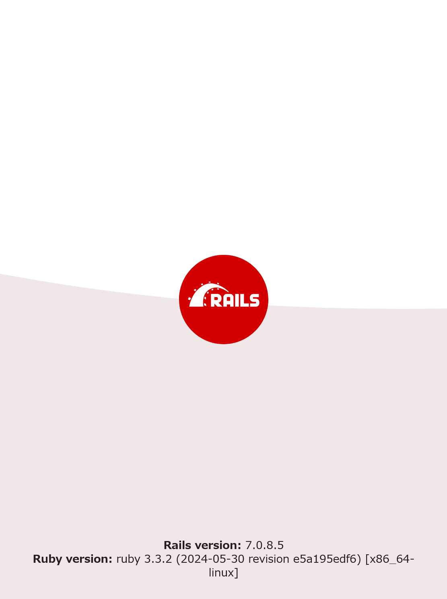

# 環境構築手順
動作確認はLinux環境で行っています．

1. RubyとRuby on Railsのインストール
   1. ruby v3.3.5をインストール,
      1. Linuxの場合は`rbenv`を使用
      2. Windowsの場合は該当バージョンのインストーラを使用
         1. 下記参考リンクを参照
      3. `ruby -v`コマンドでバージョンが表示されれば成功 
   2. rails インストール
      1. `gem install rails -v 7.0.4.3` コマンドを実行
         1. `rails -v`コマンドでバージョンが表示されれば成功
      2. `gem install bundler -v 2.5.6` コマンドを実行
         1. `bundler -v`コマンドでバージョンが表示されれば成功
   3. 必要なライブラリのインストール
      1. `bundle install` コマンドを実行
   4. サーバーの起動
      1. `rails s` コマンドを実行
      2. `http://127.0.0.1:3000`にアクセスして，以下の画面が表示されれば成功です．
      3. 

## 参考
- [Rubyの開発環境を用意しよう！（Windows用）](https://prog-8.com/docs/ruby-env-win)
- [Ruby on Railsの環境構築をしてみよう！(Windows)](https://prog-8.com/docs/rails-env-win)
- [Rails チュートリアル](https://railstutorial.jp/chapters/beginning?version=7.0#sec-installing_rails)
- [Rails ガイド](https://railsguides.jp/api_app.html)

以下はrailsによって自動生成されたREADME.mdの内容
# README

This README would normally document whatever steps are necessary to get the
application up and running.

Things you may want to cover:

* Ruby version
v3.3.5
* System dependencies

* Configuration

* Database creation

* Database initialization

* How to run the test suite

* Services (job queues, cache servers, search engines, etc.)

* Deployment instructions

* ...
